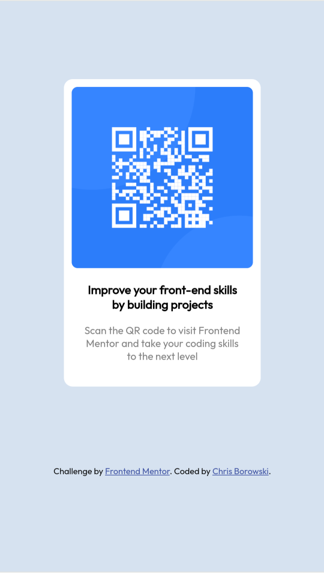

# Frontend Mentor - QR code component solution

This is a solution to the [QR code component challenge on Frontend Mentor](https://www.frontendmentor.io/challenges/qr-code-component-iux_sIO_H). Frontend Mentor challenges help you improve your coding skills by building realistic projects. 

## Table of contents

- [Overview](#overview)
  - [Screenshots](#screenshots)
  - [Links](#links)
- [My process](#my-process)
  - [Built with](#built-with)
  - [What I learned](#what-i-learned)
  - [Continued development](#continued-development)
  - [Useful resources](#useful-resources)
- [Author](#author)
- [Acknowledgments](#acknowledgments)

**Note: Delete this note and update the table of contents based on what sections you keep.**

## Overview

### Screenshots

Desktop:
  

Mobile:
  

### Links

- Solution URL: [GitHub](https://github.com/borowski/borowski.github.io)
- Live Site URL: [GitHub Pages](https://borowski.github.io/)

## My process

### Built with

- Semantic HTML5 markup
- CSS custom properties
- Flexbox
- Mobile-first workflow
- Web fonts

### What I learned

As far as this style of development goes, I'm a lot more comfortable and familiar with basic JavaScript than HTML or CSS. I have also never attempted to create a new page based on an existing design, as this challenge asks you to do.

As a result, much of what I did here was new to me. It was fun playing around with the CSS, as trial-and-error felt like the most obvious way to get closer and closer to the sample images.

That defnitely made me more comfortable with that style of work, which I gather is a pretty basic requirement for modern web dev with a team. Overall, I'd say this was a pretty well-designed challenge for a beginner like me.

### Continued development

The main sticking point for me here was downloading Google's "Outfit" web font and using the correct weights, as indicated in the style guide. I failed to get the 100 weighting for the font working, which would should have lightened up the second paragraph of text inside the QR component.

I gave up and eventually just assigned a CSS color to the text, which worked but felt pretty hacky. I'd like to figure out what I did wrong, and think I'll start by sitting down and reading an intro to web fonts.

I'd also like to go back and clean up my CSS, which accounted for the bulk of the effort here. This project is far from perfect, but I feel like I would personally be better served by taking on a new one, for now. I've scheduled a reminder to come back and look at this one again in a few months.

### Useful resources

- [mdn](https://developer.mozilla.org/en-US/) - Everybody knows it already, but I mostly relied on good ol' mdn for this project.
- [Using web fonts](https://fonts.google.com/knowledge/using_type/using_web_fonts) - I only skimmed Google's "Using web fonts" docs, because I was in a hurry at the time, but they did help a bit.

## Author

- Website - [Chris Borowski](https://www.github.com/borowski)
- Frontend Mentor - [@yourusername](https://www.frontendmentor.io/profile/borowski)